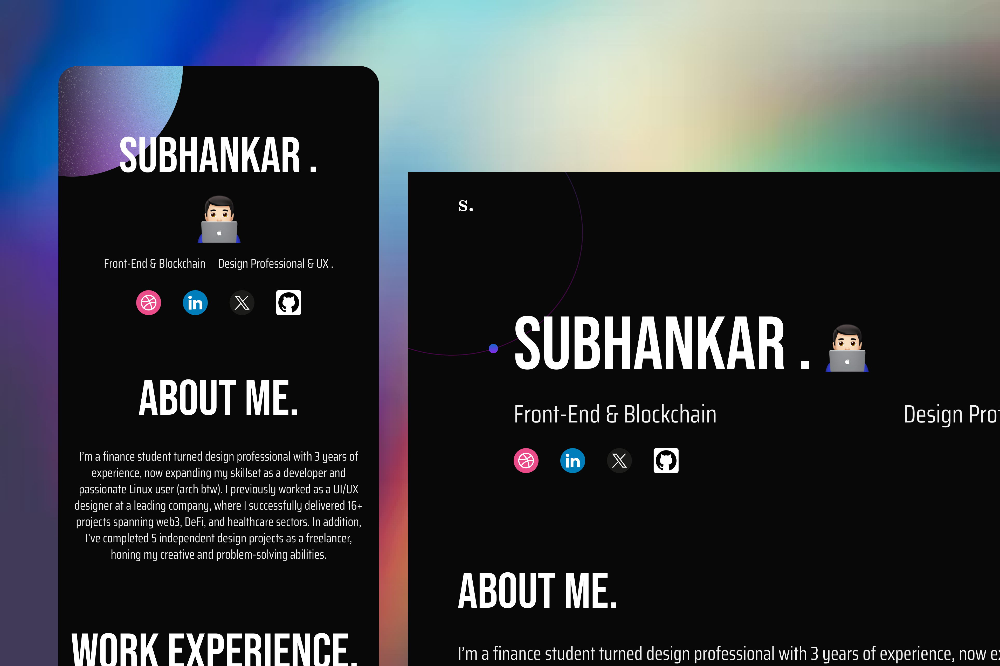

# Subhankar's Portfolio Website

A modern, responsive portfolio website showcasing my journey from finance to UI/UX design and development. Built with React and featuring smooth animations, this portfolio highlights my projects and experiences in Web3, DeFi, and healthcare sectors.



## 🛠 Technologies Used

- **Framework:** React 19
- **Build Tool:** Vite 6
- **Styling:**
  - TailwindCSS 4
  - Custom CSS animations
- **Animations:**
  - GSAP (GreenSock Animation Platform)
  - Custom scroll-triggered animations
- **Code Quality:**
  - ESLint
  - Modern JavaScript (ES6+)

## ✨ Features

- 🎨 Modern, minimalist design
- 📱 Fully responsive layout
- 🔄 Smooth scroll animations
- 💫 GSAP-powered transitions
- 🖱️ Custom cursor effects
- 📧 Direct email contact integration
- 🌗 Custom scrollbar with hover effects

## 🚀 Getting Started

### Prerequisites

- Node.js (v18 or higher recommended)
- npm or yarn

### Installation

1. Clone the repository:

   ```bash
   git clone https://github.com/yourusername/subhankar-portfolio.git
   cd subhankar-portfolio
   ```

2. Install dependencies:

   ```bash
   npm install
   # or
   yarn install
   ```

3. Start the development server:

   ```bash
   npm run dev
   # or
   yarn dev
   ```

4. Open your browser and visit:
   ```
   http://localhost:5173
   ```

## 🏗️ Project Structure

```
src/
├── components/     # Reusable UI components
├── sections/       # Main page sections
├── constants/      # Configuration and content
├── styles/        # Global styles and animations
└── assets/        # Static assets
```

## 📦 Build for Production

To create a production build:

```bash
npm run build
# or
yarn build
```

The built files will be in the `dist` directory.

To preview the production build:

```bash
npm run preview
# or
yarn preview
```

## 🔧 Customization

1. Update personal information in `src/constants/index.js`
2. Modify styles in `src/index.css` and `src/styles/animations.css`
3. Add/remove sections in `src/App.jsx`

## 📄 License

This project is available for reuse with attribution. Feel free to use it as a template for your own portfolio!

## 👥 Contact

For any queries or collaboration opportunities, feel free to reach out:

- Email: officialsubhankar01@gmail.com
- LinkedIn: [Subhankar Choudhury](https://www.linkedin.com/in/subh-choudhury/)
- GitHub: [anynomousfriend](https://github.com/anynomousfriend)
